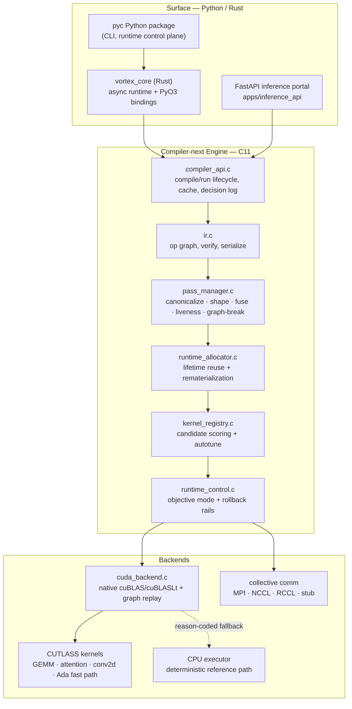
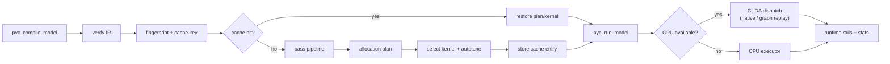

<div align="center">

# PyC

**A unified HPC toolchain — deterministic compiler, async runtime, CUTLASS kernels, and SciML inference.**

PyC pairs a rock-stable, cross-platform CMake core with an experimental "compiler-next" optimization stack: an SSA-style IR, a deterministic pass pipeline, a memory planner, kernel autotuning, and a reason-coded CUDA dispatch path with graph replay.

[](https://github.com/DarkStarStrix/PyC/actions/workflows/cmake-multi-platform.yml)
[](LICENSE)


</div>

---

## Table of Contents

- [Why PyC](#why-pyc)
- [Architecture](#architecture)
- [Repository Layout](#repository-layout)
- [Quick Start](#quick-start)
- [Build Targets](#build-targets)
- [Using PyC](#using-pyc)
- [Benchmarking](#benchmarking)
- [GPU Benchmarking](#gpu-benchmarking-remote-cuda)
- [Documentation](#documentation)
- [Project Status](#project-status)
- [Contributing](#contributing)
- [License](#license)

---

## Why PyC

PyC is built around two contracts that evolve independently:

| Contract | Promise | Scope |
|---|---|---|
| **Stable core** | Reproducible CMake targets, deterministic CI, clean downstream linking | `pyc_core_obj`, `pyc_core`, `pyc_foundation`, `pyc` |
| **Compiler-next** | Fast-moving optimization research with explicit, observable behavior | IR, passes, allocator, kernel registry, runtime rails, CUDA backend, AI bridge |

The guiding design rule is **isolation**: the experimental compiler stack can move quickly without ever destabilizing the stable artifacts that CI and downstream consumers depend on.

What sets the compiler-next stack apart:

- **Deterministic by construction** — module fingerprinting, a content-addressed compile cache, and strict-mode guards that fail loud with explicit reasons instead of drifting silently.
- **Reason-coded fallback** — every CUDA dispatch records *why* it took the native path, replayed a captured graph, or fell back to the CPU executor.
- **Observable optimization** — decision logs and `pyc_run_stats` expose objective mode, pressure score, kernel selection traces, graph-break taxonomy, and autotune state.
- **Co-designed memory + kernels** — a first-fit lifetime-reuse allocator and a scoring kernel registry that share pressure signals.

## Architecture

PyC is a polyglot stack. A thin Python/Rust surface sits over a deterministic C engine, which dispatches to CUDA/CUTLASS kernels when a GPU is present and falls back to a CPU executor otherwise.



**Compile → run lifecycle:**



For the full component matrix, IR rules, pass order, allocator algorithm, selection scoring, and CUDA control variables, see [`docs/architecture/system-architecture.md`](docs/architecture/system-architecture.md).

## Repository Layout

```
PyC/
├── src/
│   ├── core/              # Stable C core: file adapter, symbol table, stack, CI driver
│   ├── compiler/          # Compiler-next: IR, passes, runtime rails, CUDA backend, AI bridge
│   │   ├── ir/            # Op-graph IR + deterministic serialization
│   │   ├── passes/        # Canonicalize, shape inference, fusion, liveness, graph-break
│   │   ├── runtime/       # Allocator, kernel registry, controller, CUDA + comm backends
│   │   └── cutlass_kernels/  # GEMM, attention, conv2d, Ada async fast path
│   └── runtime/           # Rust async runtime (vortex_core) + PyO3 bindings
├── include/pyc/           # Public C headers (the compiler-next API surface)
├── python/pyc/            # Python package: CLI, runtime control plane, telemetry
├── apps/inference_api/    # FastAPI inference portal
├── kernels/               # Kernel lab tooling + Ada/Hopper prototype families
├── benchmark/             # Deterministic benchmark harness, workloads, regression gates
├── tests/                 # C compiler-next tests + Python tests + repo validators
├── infra/                 # GPU-host bootstrap (Docker image + setup scripts)
├── scripts/               # Developer + benchmark automation
├── docs/                  # Architecture, references, plans, reports, roadmap
└── web/site/              # Static site, download page, inference portal, published results
```

## Quick Start

**Prerequisites:** CMake ≥ 3.10, a C11 compiler, and Python 3 (for the benchmark harness).

```bash
# Configure and build the stable core targets
cmake -S . -B build
cmake --build build --parallel --target pyc pyc_core pyc_foundation

# Smoke test
./build/pyc          # Linux/macOS
# .\build\Release\pyc.exe   # Windows multi-config generators
```

Expected output:

```text
PyC CI driver: core targets configured successfully.
```

To build the experimental compiler-next stack and its smoke test:

```bash
cmake -S . -B build -D PYC_BUILD_COMPILER_NEXT=ON -D PYC_BUILD_COMPILER_NEXT_TESTS=ON
cmake --build build --parallel --target pyc_compiler_next pyc_compiler_next_smoke
./build/pyc_compiler_next_smoke
ctest --test-dir build --output-on-failure
```

> **Incremental builds:** reuse the same `build/` directory and re-run `cmake --build build --parallel`. CI's Linux/macOS jobs use `ccache` to cut repeated compile time.

## Build Targets

| Target | Type | Description |
|---|---|---|
| `pyc_core_obj` | object library | Stable core objects, compiled once |
| `pyc_core` | static library | Canonical static library for downstream linking |
| `pyc_foundation` | static library | Compatibility alias of the same objects |
| `pyc` | executable | Minimal deterministic CI/smoke driver |
| `pyc_compiler_next` | static library | Compiler-next engine *(requires `PYC_BUILD_COMPILER_NEXT=ON`)* |
| `pyc_compiler_next_smoke` | executable | Compiler-next smoke test |
| `pyc_compiler_next_test_*` | executables | Deterministic compiler-next test suite *(requires `PYC_BUILD_COMPILER_NEXT_TESTS=ON`)* |

### Continuous Integration

A single canonical workflow — [`cmake-multi-platform.yml`](.github/workflows/cmake-multi-platform.yml) — runs on Ubuntu, macOS, and Windows:

1. CMake configure
2. Build + smoke-test the compiler-next targets
3. `ctest` across the deterministic suite
4. Build + smoke-test the stable targets
5. Benchmark regression guardrail (Ubuntu)

CI also enforces **source coverage**: every active `.c` file under `src/core/C_Files`, `src/compiler`, and `tests/compiler_next` must be referenced by `CMakeLists.txt`, or the build fails.

## Using PyC

### Link `pyc_core` into your project

```bash
cmake -S . -B build
cmake --build build --parallel --target pyc_core
```

In your C/C++ project, add the include path `src/core/Header_Files/` and link `build/libpyc_core.a` (or the platform equivalent). Use `pyc_foundation` only where downstream compatibility requires it.

### Compiler-next public API

The compiler-next surface is the set of headers under [`include/pyc/`](include/pyc/):

| Header | Purpose |
|---|---|
| `compiler_api.h` | Compile/run lifecycle, options, output stats, decision log |
| `ir.h` | Op-graph IR construction and verification |
| `pass_manager.h` | Pass pipeline configuration and reports |
| `runtime_allocator.h` | Lifetime-based allocation planner |
| `kernel_registry.h` | Kernel candidate registration, scoring, autotune |
| `runtime_control.h` | Objective-mode switching and rollback rails |
| `cuda_backend.h` | CUDA dispatch, graph replay, reason-coded fallback |
| `ai_bridge.h` | AI-assisted optimization bridge layer |

## Benchmarking

PyC ships a deterministic benchmark harness for the stable core targets.

```bash
python3 benchmark/harness.py --repeats 7 --micro-rounds 4000
```

Outputs:

- `benchmark/benchmarks/results/json/latest_core.json`
- `benchmark/benchmarks/results/reports/latest_core.md`
- `docs/reports/performance-results.md`

Publish website-ready artifacts:

```bash
python3 scripts/publish_site_results.py
# -> web/site/results/manifest.json, latest-summary.json, artifacts/**
```

See [`docs/reference/benchmarking.md`](docs/reference/benchmarking.md) for methodology.

## GPU Benchmarking (Remote CUDA)

For real GPU testing on a rented Linux host:

```bash
# 1. Provision Ubuntu + NVIDIA GPU, then reuse the bootstrap image
bash infra/build_bootstrap_image.sh
INSTALL_SYSTEM_DEPS=0 bash infra/run_bootstrap_image.sh

# 2. Validate the toolchain if needed
bash scripts/setup_cuda_remote_ubuntu.sh
source .venv/bin/activate

# 3. Run the standardized GPU suite
python3 benchmark/benchmarks/gpu/run_gpu_suite.py --device cuda --tag gpu_baseline
```

Human-readable single run:

```bash
bash scripts/run_pyc_bench_pretty.sh cuda 64 1024 5 2
```

Kernel-level Ada work via the kernel lab:

```bash
python3 kernels/lab/kernel_lab.py task-create ada-sm89-gemm --task-kind gemm --candidate-tag ada
python3 benchmark/benchmarks/gpu/run_gemm_suite.py \
    --matrix-file benchmark/benchmarks/gpu/configs/ada_fp32_gemm_shapes.json --dry-run
```

The adapter comparison covers `torch_eager`, `torch_compile`, `pyc`, `tvm`, `xla`, `tensorrt`, and `glow`. For non-PyTorch backends, point the corresponding env var (e.g. `TVM_BENCH_CMD`, `TENSORRT_BENCH_CMD`, `PYC_GPU_BENCH_CMD`) at a command that emits JSON. Full guide: [`docs/compiler-next/gpu-testing-playbook.md`](docs/compiler-next/gpu-testing-playbook.md).

## Documentation

Start with the [documentation index](docs/README.md). High-value entry points:

| Topic | Document |
|---|---|
| System architecture & data flow | [`docs/architecture/system-architecture.md`](docs/architecture/system-architecture.md) |
| Project overview & terminology | [`docs/reference/project-overview.md`](docs/reference/project-overview.md) |
| Build & CI reference | [`docs/reference/build-and-ci.md`](docs/reference/build-and-ci.md) |
| Benchmark methodology | [`docs/reference/benchmarking.md`](docs/reference/benchmarking.md) |
| Compiler-next overview | [`docs/compiler-next/overview.md`](docs/compiler-next/overview.md) |
| IR specification | [`docs/compiler-next/ir-spec.md`](docs/compiler-next/ir-spec.md) |
| Pass pipeline | [`docs/compiler-next/pass-pipeline.md`](docs/compiler-next/pass-pipeline.md) |
| Memory planner | [`docs/compiler-next/runtime-memory-planner.md`](docs/compiler-next/runtime-memory-planner.md) |
| CUDA GEMM fast path | [`docs/compiler-next/cuda-gemm-fast-path.md`](docs/compiler-next/cuda-gemm-fast-path.md) |
| Project status | [`docs/reports/project-status.md`](docs/reports/project-status.md) |

## Project Status

- **Stable core** — cross-platform CMake/link targets are in place and gated by deterministic CI.
- **Compiler-next** — functional behind `PYC_BUILD_COMPILER_NEXT=ON`; covered by a deterministic test suite but **not yet part of the stable CI guarantees**. The stack spans deterministic guards, compile cache, speculative plans, phantom-graph tracking, runtime controller rails, rematerialization policy, kernel + allocator co-selection, and the Ada FP32 CUDA fast path.
- **Release binaries** — published per OS by [`release-binaries.yml`](.github/workflows/release-binaries.yml) (`pyc-linux-x86_64.tar.gz`, `pyc-macos-arm64.tar.gz`, `pyc-windows-x86_64.zip`), with an OS-detecting download page at `web/site/index.html`.

## Contributing

Contributions are welcome. Please read [`CONTRIBUTING.md`](CONTRIBUTING.md) for the workflow and validation checklist, [`docs/reference/repository-rules.md`](docs/reference/repository-rules.md) for layout guardrails, and [`CODE_OF_CONDUCT.md`](CODE_OF_CONDUCT.md). Security issues: see [`SECURITY.md`](SECURITY.md).

## License

Licensed under the [Apache License 2.0](LICENSE).
