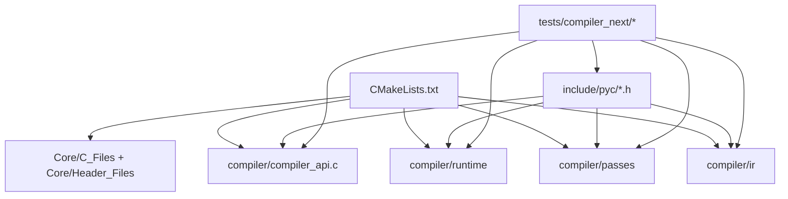
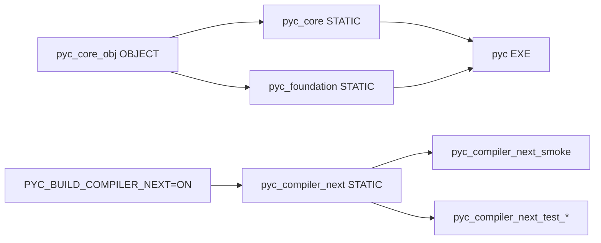
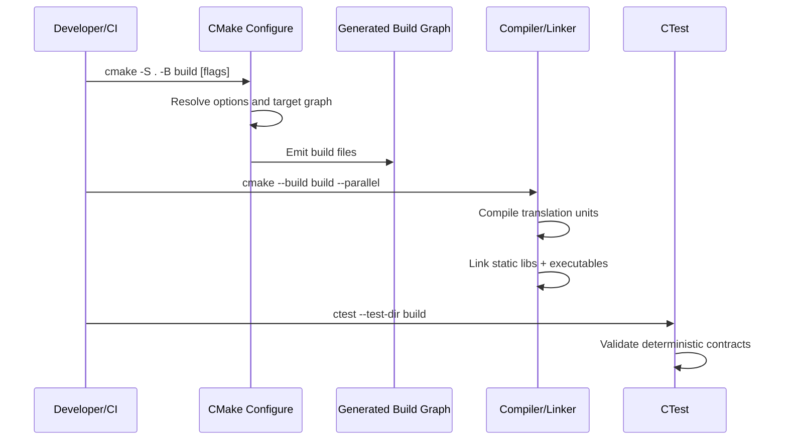
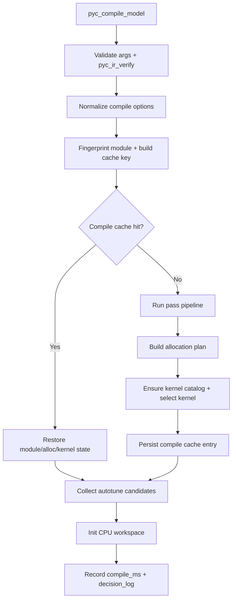
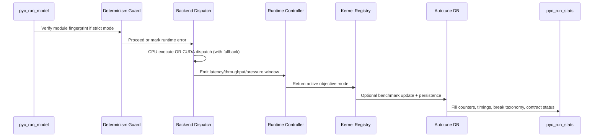
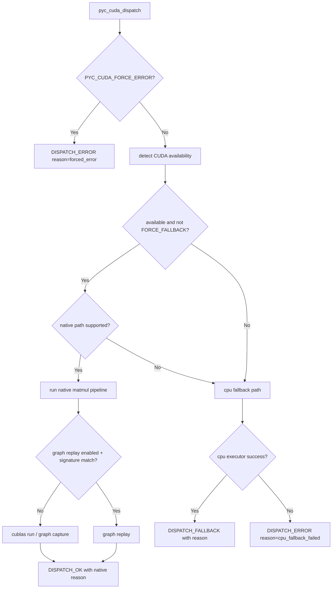

# PyC Architecture

This document explains how PyC is built and how execution flows from compile-time planning to runtime dispatch. It is intentionally implementation-oriented and aligned with the current code in `Core/`, `compiler/`, and `include/pyc/`.

## System Intent

PyC is split into two contracts:

1. Stable core contract:
- reproducible CMake targets for CI and downstream linking
- minimal surface: `pyc_core_obj`, `pyc_core`, `pyc_foundation`, `pyc`
2. Compiler-next contract:
- experimental compile/run path
- deterministic behavior, explicit fallback reasons, and runtime observability

The primary design rule is isolation: compiler-next can evolve quickly without destabilizing stable core artifacts.

## Repository Layout and Ownership

### Subsystem Matrix

| Subsystem | Public Interface | Primary Implementation | Role |
|---|---|---|---|
| IR | `include/pyc/ir.h` | `compiler/ir/ir.c` | op graph model, verification, deterministic serialization |
| Pass pipeline | `include/pyc/pass_manager.h` | `compiler/passes/pass_manager.c` | canonicalization, shape inference, fusion, liveness, graph-break analysis |
| Allocator planner | `include/pyc/runtime_allocator.h` | `compiler/runtime/runtime_allocator.c` | reuse planning, pressure scoring, rematerialization counts |
| Kernel registry | `include/pyc/kernel_registry.h` | `compiler/runtime/kernel_registry.c` | kernel candidate registration, scoring, selection, autotune stats |
| Runtime rails | `include/pyc/runtime_control.h` | `compiler/runtime/runtime_control.c` | objective-mode switching and rollback policy |
| Compiler API | `include/pyc/compiler_api.h` | `compiler/compiler_api.c` | compile/run lifecycle, cache, decision logs, output stats |
| CUDA dispatch | `include/pyc/cuda_backend.h` | `compiler/runtime/cuda_backend.c` | native CUDA path, graph replay, reason-coded fallback |

## Build Graph and Compile-Time Execution

### Configure-Time Option Effects

1. `PYC_BUILD_EXPERIMENTAL=OFF` keeps legacy experimental blocks out of stable CI path.
2. `PYC_BUILD_COMPILER_NEXT=ON` enables compiler-next library and executables.
3. `PYC_BUILD_COMPILER_NEXT_TESTS=ON` wires deterministic compiler-next tests into CTest.

## Compile Path Internals (`pyc_compile_model`)

`pyc_compile_model(...)` is the deterministic compile entrypoint exposed by `include/pyc/compiler_api.h`.

### Exact Compile Stages

1. Input validation:
- null checks and IR verification (`pyc_ir_verify`)
- immediate `PYC_STATUS_VERIFY_FAILED` on invalid modules
2. Option normalization:
- defaults loaded, then optional user overrides applied
- invalid `cache_mode` coerced to in-memory mode
- negative compile budget clamped to `0.0`
3. Deterministic strict mode behavior:
- if `deterministic_strict=1`, runtime auto-switch and hard rollback rails are disabled
- deterministic contract enforcement flag is set
4. Cache key generation:
- source fingerprint + backend + relevant option fields feed the key
- if in-memory cache enabled and key exists, compile uses cached module/plan/kernel state
5. Cache miss compile:
- pass pipeline runs with optional fusion disable
- graph-break metrics and compilability score are captured from pass report
- allocation requests synthesized from op shapes
- kernel catalog loaded and policy-aware kernel selection executed
6. Optional autotune DB preload:
- if autotune enabled, persisted results are loaded before selection
7. Candidate collection:
- deterministic candidate list via `pyc_kernel_collect`
8. Workspace init and compile metrics:
- CPU workspace initialized
- `compile_ms` measured
- compile-budget breach flag set when exceeded
9. Decision log emission:
- compile-mode snapshot written into `model->decision_log`

## IR and Pass Pipeline Mechanics

### IR Model

`pyc_ir_module` is a bounded op array (`PYC_IR_MAX_OPS`) where each `pyc_ir_op` includes:

- kind (`input`, `const`, `matmul`, `add`, `relu`, `gelu`, `reduce_sum`, `layernorm`, `output`)
- name, dtype, shape, and input ids

### Verification Rules (`pyc_ir_verify`)

1. Module must exist and contain at least one op.
2. Op input count must not exceed `PYC_IR_MAX_INPUTS`.
3. Shape rank and dimensions must be valid (`rank <= PYC_IR_MAX_DIMS`, dims > 0).
4. Input ids must be topologically valid (`0 <= input_id < current_op_index`).

### Pass Order and Behavior (`pyc_pass_pipeline_run`)

Default enabled sequence:

1. Canonicalization:
- unnamed ops are renamed `op_<index>`
2. Shape inference:
- propagates shape/dtype for `output`, `add`, activations, `layernorm`
- infers 2D matmul shape with dimension validation
3. Layout propagation:
- currently accounted as pass step for pipeline completeness
4. Fusion:
- deterministic fusion of `matmul + activation` only
- fused op keeps stable deterministic naming
5. Liveness:
- computes `peak_live_values` from producer/consumer usage windows
6. Allocation + lowering stages:
- currently represented in pass counters for full pipeline accounting
7. Graph-break analysis:
- always runs and classifies unsupported ops into:
  - `const`, `gelu`, `reduce_sum`, `layernorm`, `unknown`
- captures first break op id/name and `compilability_score`

## Memory Planner Mechanics (`runtime_allocator`)

The planner is a deterministic first-fit reuse planner over requested tensor lifetimes.

### Request Inputs

Each request includes:

- `tensor_id`
- `size_bytes`
- `alignment`
- `start_step`, `end_step`

### Build Algorithm

For each request in insertion order:

1. scan previous allocations
2. count overlap pairs (`intervals_overlap`)
3. reuse a previous offset if lifetimes do not overlap and previous buffer is large enough
4. otherwise allocate new aligned region at current peak

### Budget and Pressure Behavior

If `memory_budget_bytes > 0` and peak exceeds budget:

1. `pressure_events` is set
2. `pressure_score = excess / memory_budget_bytes`
3. mode-specific handling:
- `PYC_MODE_MEMORY_FIRST`: force peak to budget and estimate rematerialization count
- `PYC_MODE_BALANCED`: partial reduction and light rematerialization accounting
- `PYC_MODE_UTILIZATION_FIRST`: no extra memory-first reduction logic

## Kernel Registry and Selection Logic

`kernel_registry` stores candidates keyed by `op_key + backend` and selects with deterministic scoring.

### Descriptor Signals

Each `pyc_kernel_desc` includes:

- priority
- estimated occupancy
- tensor-core eligibility
- shared memory bytes
- register-pressure class

### Selection Score

Current score structure:

1. base priority term
2. occupancy-weighted utilization term
3. tensor-core bonus
4. timing component from benchmark best-time
5. pressure penalty when pressure is present and mode is not utilization-first

Deterministic tie-break:

- lexical order by `symbol` when scores are equal

### Autotune Integration

1. candidates are collected in deterministic symbol order (`pyc_kernel_collect`)
2. benchmark updates use `pyc_kernel_benchmark_update_symbol`
3. best measurements are persisted and compacted in autotune DB flow

## Runtime Path Internals (`pyc_run_model`)

### Runtime Stage Detail

1. Pre-dispatch guard:
- if deterministic contract enforced, recompute fingerprint and compare
- mismatch increments guard-miss and marks runtime error
2. Backend dispatch:
- CPU backend executes graph directly
- CUDA backend executes native path or fallback according to dispatcher outcome
3. Metrics and baselines:
- run latency measured
- baseline p95/throughput initialized on first run
4. Runtime rails controller:
- controller observes regression/pressure/error window and may change objective mode
- rollback reason and counts are updated
5. Kernel reselection:
- kernel is reselected each run using active mode and pressure score
6. Autotune writeback:
- candidate benchmark update and DB persistence on successful runs when enabled
7. Output stats:
- `pyc_run_stats` receives timings, memory stats, kernel traces, determinism status, fallback counts, graph-break taxonomy, and autotune state

### Runtime Rails Defaults

Defaults from `pyc_runtime_rails_default`:

- `dwell_steps=4`, `cooldown_steps=2`
- `consecutive_breach_windows=2`
- latency regression threshold `0.08`
- throughput regression threshold `0.05`
- pressure score threshold `0.20`

These thresholds govern auto-switch and hard rollback behavior.

## CUDA Dispatcher and Native Path

### Supported Native Chain

Native CUDA path currently targets:

- `input -> matmul -> [add] -> [relu] -> output`

Add epilogue modes supported in parsing/execution:

- matrix add
- row-bias add
- scalar add

### CUDA Control Environment Variables

| Variable | Effect |
|---|---|
| `PYC_CUDA_DISABLE=1` | report CUDA unavailable and force fallback logic |
| `PYC_CUDA_FORCE_ERROR=1` | force dispatcher error path |
| `PYC_CUDA_FORCE_FALLBACK=1` | skip native path and force CPU fallback |
| `PYC_CUDA_SIMULATE_AVAILABLE=1` | simulate CUDA availability for deterministic tests |
| `PYC_CUDA_ENABLE_GRAPH_REPLAY` | controls graph replay attempt (default enabled) |
| `PYC_CUDA_ASSUME_STATIC_RHS=1` | enables static RHS optimization in native matmul pipeline |

## Observability and Deterministic Contracts

### Decision Log Contract

`pyc_model_last_decision_log(...)` exposes a stable text snapshot that includes:

1. active objective mode
2. pressure score
3. selected kernel and score/utilization traces
4. determinism state and reason
5. cache/budget flags
6. fallback and guard counters
7. graph-break taxonomy and first-break location
8. autotune load/save state

### Core Runtime Counters (`pyc_run_stats`)

Important signals for promotion and triage:

- `deterministic_contract_enforced`, `deterministic_contract_ok`
- `guard_miss_count`, `fallback_count`
- `compile_cache_hit`, `compile_budget_exceeded`
- `graph_break_count` and per-kind counters
- `compilability_score`
- `dispatch_ms`, `graph_exec_ms`, `controller_ms`, `kernel_select_ms`

Contract rule: unsupported or unstable states must be surfaced as explicit metrics/reasons, not silent behavior drift.

## Compatibility and Promotion Gates

| Platform | Stable targets | Compiler-next CPU | Compiler-next CUDA |
|---|---|---|---|
| Linux x86_64 | required | required | native path when toolkit+GPU present |
| macOS Apple Silicon | required | required | deterministic fallback/proxy behavior |
| Windows MSVC | required | required | deterministic fallback unless CUDA stack is configured |

A compiler-next capability is promoted only when:

1. stable core build contract stays green cross-platform
2. deterministic tests pass
3. behavior change has dedicated tests
4. failure reasons are explicit and diagnosable
5. runtime signals remain observable and reproducible

## Phase 5 Implementation Outcome

Phase 5 hardening concentrated on:

1. deeper CUDA chain support around matmul + epilogues
2. graph capture/replay support for repeated signatures
3. richer graph-break taxonomy and reason-coded fallback telemetry
4. stricter promotion gates tied to deterministic contracts

Net result: PyC remains lean and deterministic while improving the execution path needed for production-style optimization work.
