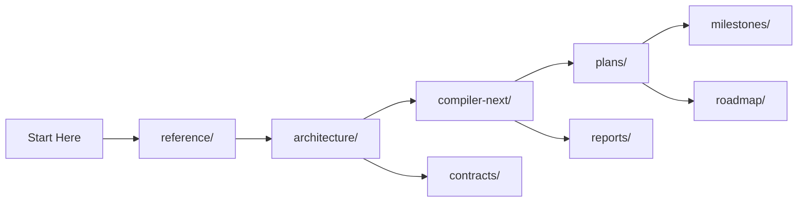

# PyC Documentation

This folder is the source of truth for project technical documentation. GitHub community-health files (`CODE_OF_CONDUCT.md`, `CONTRIBUTING.md`, `SECURITY.md`, `SUPPORT.md`) live at the repository root or under `.github/`.

## Start Here

New to the project? Read these in order:

1. [Project status](reports/project-status.md) — what is stable now vs. experimental
2. [Project overview](reference/project-overview.md) — scope, terminology, constraints
3. [System architecture](architecture/system-architecture.md) — components, data flow, module boundaries
4. [Build & CI](reference/build-and-ci.md) — canonical commands and CI behavior
5. [Benchmarking](reference/benchmarking.md) — deterministic harness and methodology
6. [Results](reports/results.md) — canonical benchmark outcomes

## Documentation Map



### Reference

| Document | Purpose |
|---|---|
| [Project overview](reference/project-overview.md) | Product and technical overview, scope, terminology, constraints |
| [Build & CI](reference/build-and-ci.md) | Canonical build commands, CI behavior, troubleshooting |
| [Benchmarking](reference/benchmarking.md) | Deterministic benchmark harness usage and methodology |
| [Repository rules](reference/repository-rules.md) | Non-negotiable layout guardrails and enforcement map |

### Architecture & Contracts

| Document | Purpose |
|---|---|
| [System architecture](architecture/system-architecture.md) | Component-level architecture, data flow, concurrency model |
| [Core ↔ AI interfaces](contracts/core_ai_interfaces.md) | Interface contracts for cross-module behavior |

### Compiler-Next

The next-generation compiler stack: IR, passes, runtime planner, kernels, and benchmark protocol.

| Document | Purpose |
|---|---|
| [Overview](compiler-next/overview.md) | Stack summary and entry points |
| [IR specification](compiler-next/ir-spec.md) | Op-graph model and verification rules |
| [Pass pipeline](compiler-next/pass-pipeline.md) | Pass order and behavior |
| [Runtime memory planner](compiler-next/runtime-memory-planner.md) | Lifetime-reuse allocation strategy |
| [CUDA GEMM fast path](compiler-next/cuda-gemm-fast-path.md) | Ada FP32 runtime path note |
| [Runtime integration spec](compiler-next/runtime-integration-spec.md) | Practical runtime usage |
| [Phantom-graph rationale](compiler-next/phantom-graph-rationale.md) | Speculative shape-tracking design |
| [Benchmark protocol](compiler-next/benchmark-protocol.md) | Measurement protocol |
| [GPU testing playbook](compiler-next/gpu-testing-playbook.md) | Remote CUDA testing flow |
| [Kernel lab](compiler-next/kernel-lab.md) | Kernel mini-lab CLI guide |
| [Roadmap phases](compiler-next/roadmap-phases.md) | Phased delivery plan |
| [Innovation backlog](compiler-next/innovation-backlog.md) | Shortlist of candidate work |
| [R&D landscape](compiler-next/rd-landscape.md) | Source-backed direction |

### Plans, Reports & Roadmap

| Document | Purpose |
|---|---|
| [Compiler-next feature buildout](plans/compiler-next-feature-buildout.md) | Active execution order |
| [Hopper ops kernel blueprint](plans/hopper-ops-kernel-blueprint.md) | Hopper bring-up order |
| [Repo streamline plan](plans/repo-streamline-plan.md) | Structure and migration plan |
| [Project status](reports/project-status.md) | Stable vs. experimental snapshot |
| [Performance report](reports/perf-report.md) | Short current-state assessment |
| [Results](reports/results.md) | Canonical benchmark outcomes and artifacts |
| [Performance results](reports/performance-results.md) | Stable-core local snapshot |
| [Distributed layer architecture](roadmap/distributed/training-spec.md) | Longer-horizon distributed planning |

### Milestones

| Document | Purpose |
|---|---|
| [v0 operational](milestones/v0_operational.md) | Milestone planning and acceptance criteria |
| [v1 AI optimization integration](milestones/v1_ai_optimization_integration.md) | AI-integration milestone |

### Adjacent READMEs

- [`benchmark/benchmarks/README.md`](../benchmark/benchmarks/README.md) — benchmark result layout, pull/analyze flow, Ada sweep workflow
- [`infra/README.md`](../infra/README.md) — GPU-host bootstrap and reusable Docker image path

## Quick Commands

```bash
# Build + smoke-test stable targets
cmake -S . -B build
cmake --build build --parallel --target pyc pyc_core pyc_foundation
./build/pyc

# Build compiler-next smoke target
cmake -S . -B build -D PYC_BUILD_COMPILER_NEXT=ON -D PYC_BUILD_COMPILER_NEXT_TESTS=ON
cmake --build build --parallel --target pyc_compiler_next pyc_compiler_next_smoke
./build/pyc_compiler_next_smoke

# Run benchmark harness
python3 benchmark/harness.py --repeats 7 --micro-rounds 4000

# Publish website benchmark artifacts
python3 scripts/publish_site_results.py

# Bootstrap a GPU VM with the reusable image
bash infra/build_bootstrap_image.sh
INSTALL_SYSTEM_DEPS=0 bash infra/run_bootstrap_image.sh
```
