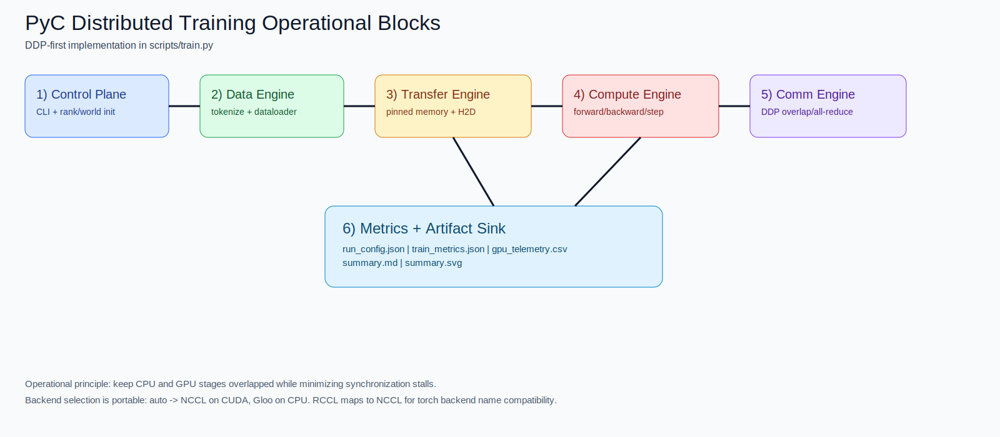

# Distributed Training Operational Blocks (DDP-First)

Date: 2026-03-05
Status: Implemented plan v1

## Purpose

This spec defines the operational block design used by `scripts/train.py` so PyC training runs are portable across local CPU, single GPU, and multi-GPU `torchrun` execution.

## Architecture



## Blocks

1. Control Plane
- Reads CLI and distributed env (`RANK`, `WORLD_SIZE`, `LOCAL_RANK`).
- Initializes process group when `--dist ddp` and `WORLD_SIZE > 1`.
- Chooses backend with `--backend auto` => `nccl` on CUDA, `gloo` otherwise.

2. Data Engine (CPU)
- Loads HF dataset and tokenizer.
- Applies bounded tokenization (`--max-length`) and sample caps.
- Builds DataLoader with `--dataloader-workers`, `--prefetch-factor`, `--pin-memory`, and `--persistent-workers`.

3. Transfer Engine (CPU->GPU)
- Moves batch tensors to device with `--non-blocking-h2d`.
- Captures host->device staging timing (`h2d_time_ms_mean`).

4. Compute Engine (GPU)
- Runs forward/backward/optimizer/scheduler loop.
- Optional mixed precision (`--mixed-precision fp16|bf16`).
- Optional torch compile modes (`--torch-compile`).

5. Comm Engine (DDP)
- Uses DDP gradient synchronization on sync steps.
- Approximates comm overhead by comparing sync-backward vs no-sync-backward.
- Emits `comm_time_ms_mean` for trend tracking.

6. Metrics + Artifact Sink
- Writes run artifacts to `<out-root>/<run-id>/`:
  - `run_config.json`
  - `train_metrics.json`
  - `gpu_telemetry.csv`
  - `summary.md`
  - `summary.svg`

## CLI Contract

Core flags:
- `--mode {conventional,nexa_vortex}`
- `--dist {none,ddp}`
- `--backend {auto,nccl,rccl,mpi,gloo}`

Model/data:
- `--model-name`, `--dataset-name`, `--dataset-config`
- `--max-train-samples`, `--max-eval-samples`, `--max-length`

Training:
- `--epochs`, `--per-device-batch`, `--grad-accum`
- `--lr`, `--weight-decay`, `--warmup-ratio`

Pipeline/overlap:
- `--dataloader-workers`, `--prefetch-factor`
- `--pin-memory`, `--persistent-workers`, `--non-blocking-h2d`

Runtime:
- `--torch-compile`, `--compile-cache-dir`
- `--mixed-precision`, `--gradient-checkpointing`, `--seed`

Output and UX:
- `--run-id`, `--out-root`, `--telemetry-interval-sec`, `--progress`

## Result Schema

`train_metrics.json` includes:
- `train_runtime_sec`, `samples_per_sec`, `steps_per_sec`, `tokens_per_sec`
- `loss_final`, `loss_curve`, `eval_loss`
- `gpu_util_mean`, `gpu_util_p95`
- `h2d_time_ms_mean`, `compute_time_ms_mean`, `comm_time_ms_mean`
- `idle_gap_ms_mean`, `idle_gap_ms_p95`
- run identity fields: `mode`, `dist`, `backend`, `world_size`, `model_name`, `dataset_name`

`gpu_telemetry.csv` columns:
- `ts_utc,rank,gpu_id,util_gpu,util_mem,mem_used_mb,mem_total_mb,power_w,temp_c`

## Default Operational Commands

Single GPU smoke:

```bash
python3 scripts/train.py \
  --mode conventional \
  --dist none \
  --model-name distilbert-base-uncased \
  --dataset-name ag_news \
  --epochs 0.1 \
  --max-train-samples 2048 \
  --max-eval-samples 512 \
  --per-device-batch 8 \
  --out-root benchmark/benchmarks/results/remote_results/local_smoke
```

8-GPU DDP serious run:

```bash
OMP_NUM_THREADS=4 MKL_NUM_THREADS=4 TOKENIZERS_PARALLELISM=false \
NCCL_DEBUG=WARN TORCH_NCCL_ASYNC_ERROR_HANDLING=1 \
torchrun --standalone --nproc_per_node=8 scripts/train.py \
  --mode nexa_vortex \
  --dist ddp \
  --backend nccl \
  --model-name distilbert-base-uncased \
  --dataset-name ag_news \
  --epochs 1.0 \
  --max-train-samples 120000 \
  --max-eval-samples 7600 \
  --max-length 256 \
  --per-device-batch 8 \
  --grad-accum 4 \
  --dataloader-workers 4 \
  --prefetch-factor 4 \
  --pin-memory true \
  --non-blocking-h2d true \
  --mixed-precision bf16 \
  --torch-compile none \
  --out-root benchmark/remote_results/runpod_h100_8x/campaign_v4
```
