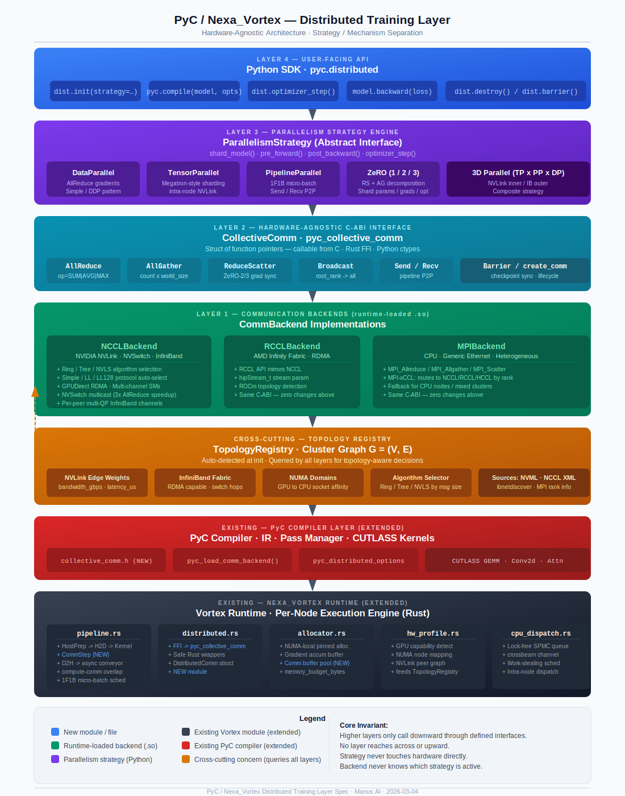

# Specification: Distributed Training Layer for PyC / Nexa_Vortex

**Author:** Manus AI
**Status:** Draft v1.0 — For Review
**Date:** 2026-03-04

---

## Table of Contents

1. [Design Philosophy](#1-design-philosophy)
2. [System Context and Integration Points](#2-system-context-and-integration-points)
3. [Layer Architecture](#3-layer-architecture)
4. [Abstraction 1 — Topology Registry](#4-abstraction-1--topology-registry)
5. [Abstraction 2 — Collective Communication Interface](#5-abstraction-2--collective-communication-interface)
6. [Abstraction 3 — Communication Backends](#6-abstraction-3--communication-backends)
7. [Abstraction 4 — Parallelism Strategy](#7-abstraction-4--parallelism-strategy)
8. [Topology-Aware Routing and Algorithm Selection](#8-topology-aware-routing-and-algorithm-selection)
9. [Memory Management at Scale](#9-memory-management-at-scale)
10. [PyC Compiler Integration Seams](#10-pyc-compiler-integration-seams)
11. [Nexa_Vortex Runtime Integration Seams](#11-nexa_vortex-runtime-integration-seams)
12. [Python SDK API](#12-python-sdk-api)
13. [Implementation Roadmap](#13-implementation-roadmap)
14. [References](#14-references)

---

## 1. Design Philosophy

The fundamental design principle of this layer is the **strict separation of strategy from mechanism**. A distributed training system has two orthogonal concerns that are routinely conflated in existing frameworks, leading to rigid, hardware-specific implementations:

- **Strategy:** *How* is the model parallelized? Which tensors are sharded? Across which axes? Which collective operations are needed and when? This is a mathematical and algorithmic question.
- **Mechanism:** *How* does data physically move between devices? Which interconnect is used? Which algorithm (ring, tree, NVLS) minimizes latency for this message size on this topology? This is a hardware and systems question.

By separating these two concerns into distinct, composable abstractions, the PyC distributed layer can support any combination of parallelism technique and hardware interconnect. A `ZeROStrategy` written once will work identically whether the underlying backend is NCCL over NVLink, RCCL over Infinity Fabric, or MPI over InfiniBand — because the strategy only ever calls the abstract `CollectiveComm` interface, never the hardware directly.

This design is grounded in the principle of **hardware-agnostic programming** as described in HPVM [1] and the portable collective communication abstraction demonstrated by MPI-xCCL [2], which showed that a single abstraction layer over NCCL, RCCL, HCCL, and MSCCL can achieve comparable or superior performance to pure native implementations.

---

## 2. System Context and Integration Points

The distributed training layer sits between the PyC compiler and the Nexa_Vortex single-node runtime. It is not a replacement for either — it is a coordination layer that orchestrates multiple Vortex instances across nodes.

```
┌──────────────────────────────────────────────────────────────────────┐
│                         Python SDK (pyc.distributed)                 │
│  ParallelismStrategy selection, communicator init, user-facing API   │
└─────────────────────────────┬────────────────────────────────────────┘
                              │
┌─────────────────────────────▼────────────────────────────────────────┐
│                   Distributed Coordination Layer  (NEW)              │
│                                                                      │
│  ┌─────────────────────┐   ┌──────────────────────────────────────┐  │
│  │  Topology Registry  │   │  Parallelism Strategy Engine         │  │
│  │  (cluster graph,    │   │  (DataParallel, TensorParallel,      │  │
│  │  NVLink/IB edges,   │   │   Pipeline, ZeRO, 3D composite)      │  │
│  │  NUMA domains)      │   └──────────────┬───────────────────────┘  │
│  └─────────────────────┘                  │                          │
│                              ┌────────────▼────────────────────────┐ │
│                              │  CollectiveComm Interface (C-ABI)   │ │
│                              │  AllReduce / AllGather /            │ │
│                              │  ReduceScatter / Broadcast / Send   │ │
│                              └────────────┬────────────────────────┘ │
│                                           │                          │
│              ┌────────────────────────────┼──────────────────────┐   │
│              │                            │                      │   │
│  ┌───────────▼──────┐  ┌──────────────────▼───┐  ┌──────────────▼─┐ │
│  │  NCCLBackend     │  │  RCCLBackend          │  │  MPIBackend    │ │
│  │  (NVIDIA NVLink/ │  │  (AMD Infinity        │  │  (CPU, generic │ │
│  │   InfiniBand)    │  │   Fabric / RDMA)      │  │   Ethernet)    │ │
│  └──────────────────┘  └──────────────────────┘  └────────────────┘ │
└──────────────────────────────────────────────────────────────────────┘
                              │
┌─────────────────────────────▼────────────────────────────────────────┐
│                    PyC Compiler + CUTLASS Kernels                    │
│              (IR, pass manager, kernel registry, GEMM/Attn)          │
└─────────────────────────────┬────────────────────────────────────────┘
                              │
┌─────────────────────────────▼────────────────────────────────────────┐
│                    Nexa_Vortex Runtime (per node)                    │
│     (async pipeline, NUMA allocator, lock-free dispatcher)           │
└──────────────────────────────────────────────────────────────────────┘
```

The distributed layer has **no knowledge of individual GPU kernels** — that is the compiler's job. It has **no knowledge of memory allocation** — that is the Vortex runtime's job. Its sole responsibility is coordinating the movement of tensors between devices and nodes.

---

## 3. Layer Architecture



The diagram above is the canonical architectural view for this spec and maps directly to the C-ABI and backend-loading seams defined in this document.

The layer is composed of four primary abstractions, each with a defined interface and a set of concrete implementations. The key architectural invariant is that **higher layers only ever call downward through the defined interfaces** — no layer reaches across or upward.

| Layer | Abstraction | Concrete Implementations |
| :--- | :--- | :--- |
| **4 (top)** | `ParallelismStrategy` | `DataParallel`, `TensorParallel`, `PipelineParallel`, `ZeRO`, `ThreeDParallel` |
| **3** | `CollectiveComm` (C-ABI) | Implemented by each backend |
| **2** | `CommBackend` | `NCCLBackend`, `RCCLBackend`, `MPIBackend` |
| **1 (bottom)** | `TopologyRegistry` | Auto-detected at init time |

---

## 4. Abstraction 1 — Topology Registry

The `TopologyRegistry` is the foundation of the entire distributed layer. It is responsible for building a **graph model of the cluster** at initialization time, which all higher layers use to make topology-aware decisions.

### 4.1 Graph Model

The topology is represented as a weighted directed graph `G = (V, E)` where:

- **Vertices `V`** represent compute devices (GPUs, CPUs). Each vertex carries metadata: `device_id`, `node_id`, `numa_domain`, `device_type` (NVIDIA/AMD/CPU), `memory_bytes`, `compute_tflops`.
- **Edges `E`** represent communication links between devices. Each edge carries: `link_type` (NVLink, NVSwitch, PCIe, InfiniBand, RoCE, Ethernet), `bandwidth_gbps`, `latency_us`, `is_rdma_capable`.

This graph is the single source of truth for all topology-aware decisions in the system.

### 4.2 Detection Strategy

The `TopologyRegistry` is populated at startup using a multi-source detection strategy:

1. **NVIDIA NVML / AMD ROCm SMI:** Queries per-device properties (memory, compute capability, NVLink peer connectivity).
2. **NCCL/RCCL `ncclGetUniqueId` + topology XML:** NCCL exposes an internal topology XML that describes the full NVLink/PCIe graph. This is parsed directly.
3. **MPI `MPI_Comm_rank` / `MPI_Get_processor_name`:** For multi-node clusters, MPI is used to gather per-node information and construct the inter-node graph.
4. **InfiniBand `ibstat` / `ibnetdiscover`:** Queries the InfiniBand fabric to determine switch topology, link speeds, and RDMA capabilities.

### 4.3 Key Queries

The `TopologyRegistry` exposes a set of queries that higher layers use:

- `get_intra_node_bandwidth(device_a, device_b) -> float`: Returns the bandwidth in GB/s between two devices on the same node.
- `get_inter_node_bandwidth(node_a, node_b) -> float`: Returns the inter-node bandwidth.
- `get_nvlink_peers(device_id) -> List[device_id]`: Returns all devices directly connected via NVLink.
- `is_nvswitch_connected(device_ids: List) -> bool`: Returns true if all listed devices are connected via a common NVSwitch fabric.
- `get_numa_domain(device_id) -> int`: Returns the NUMA node of the CPU closest to the given GPU.
- `optimal_collective_algorithm(op: CollectiveOp, n_devices: int, msg_size_bytes: int) -> Algorithm`: Returns the recommended algorithm (Ring, Tree, NVLS) for a given collective operation, device count, and message size, based on the topology graph and empirical performance models.

---

## 5. Abstraction 2 — Collective Communication Interface

The `CollectiveComm` interface is defined as a **C-ABI struct of function pointers**. This is the most critical design decision in the entire layer: by using a C-ABI, the interface is language-agnostic and can be called from C, Rust (via FFI), and Python (via ctypes) without any language-specific binding overhead.

### 5.1 C-ABI Definition (`include/pyc/collective_comm.h`)

```c
#ifndef PYC_COLLECTIVE_COMM_H
#define PYC_COLLECTIVE_COMM_H

#include <stddef.h>
#include "pyc/ir.h"

#ifdef __cplusplus
extern "C" {
#endif

/* Reduction operations for AllReduce and Reduce */
typedef enum {
    PYC_REDUCE_SUM  = 0,
    PYC_REDUCE_PROD = 1,
    PYC_REDUCE_MIN  = 2,
    PYC_REDUCE_MAX  = 3,
    PYC_REDUCE_AVG  = 4
} pyc_reduce_op;

/* Status codes returned by all collective operations */
typedef enum {
    PYC_COMM_OK             = 0,
    PYC_COMM_ERR_TIMEOUT    = 1,
    PYC_COMM_ERR_HARDWARE   = 2,
    PYC_COMM_ERR_INVALID    = 3
} pyc_comm_status;

/*
 * pyc_comm_handle_t
 *
 * Opaque handle to a communicator group. Analogous to ncclComm_t or
 * MPI_Comm. Created by the backend at init time and passed to all
 * collective operations.
 */
typedef void* pyc_comm_handle_t;

/*
 * pyc_collective_comm
 *
 * The core C-ABI interface. A CommBackend fills in this struct with
 * function pointers to its implementations. Higher layers call through
 * this struct and never touch the backend directly.
 *
 * All operations are non-blocking and stream-ordered. The caller is
 * responsible for synchronizing the stream before reading results.
 * stream is typed as void* to avoid pulling in CUDA/ROCm headers here;
 * callers cast to cudaStream_t / hipStream_t as appropriate.
 */
typedef struct {
    /* Opaque backend state */
    void* backend_ctx;

    /*
     * all_reduce: Reduces send_buf across all ranks and distributes
     * the result to all recv_buf. Equivalent to ncclAllReduce.
     */
    pyc_comm_status (*all_reduce)(
        void*              backend_ctx,
        pyc_comm_handle_t  comm,
        const void*        send_buf,
        void*              recv_buf,
        size_t             count,
        pyc_dtype          dtype,
        pyc_reduce_op      op,
        void*              stream
    );

    /*
     * all_gather: Each rank contributes send_buf; all ranks receive
     * the concatenation of all contributions in recv_buf.
     * recv_buf must be count * world_size elements.
     */
    pyc_comm_status (*all_gather)(
        void*              backend_ctx,
        pyc_comm_handle_t  comm,
        const void*        send_buf,
        void*              recv_buf,
        size_t             count,        /* per-rank element count */
        pyc_dtype          dtype,
        void*              stream
    );

    /*
     * reduce_scatter: Reduces send_buf across all ranks, then
     * scatters the result so each rank receives a disjoint slice.
     * recv_buf receives count elements (send_buf has count * world_size).
     */
    pyc_comm_status (*reduce_scatter)(
        void*              backend_ctx,
        pyc_comm_handle_t  comm,
        const void*        send_buf,
        void*              recv_buf,
        size_t             count,        /* per-rank element count */
        pyc_dtype          dtype,
        pyc_reduce_op      op,
        void*              stream
    );

    /*
     * broadcast: Copies send_buf from root rank to all recv_buf.
     */
    pyc_comm_status (*broadcast)(
        void*              backend_ctx,
        pyc_comm_handle_t  comm,
        const void*        send_buf,
        void*              recv_buf,
        size_t             count,
        pyc_dtype          dtype,
        int                root_rank,
        void*              stream
    );

    /*
     * send / recv: Point-to-point operations for pipeline parallelism.
     * Non-blocking; must be paired with a matching recv/send.
     */
    pyc_comm_status (*send)(
        void*              backend_ctx,
        pyc_comm_handle_t  comm,
        const void*        send_buf,
        size_t             count,
        pyc_dtype          dtype,
        int                peer_rank,
        void*              stream
    );

    pyc_comm_status (*recv)(
        void*              backend_ctx,
        pyc_comm_handle_t  comm,
        void*              recv_buf,
        size_t             count,
        pyc_dtype          dtype,
        int                peer_rank,
        void*              stream
    );

    /*
     * barrier: Synchronizes all ranks. Blocks until all ranks
     * have called barrier. Used for checkpoint synchronization.
     */
    pyc_comm_status (*barrier)(
        void*              backend_ctx,
        pyc_comm_handle_t  comm
    );

    /*
     * Communicator lifecycle management.
     */
    pyc_comm_handle_t (*create_comm)(void* backend_ctx, int world_size, int rank);
    void              (*destroy_comm)(void* backend_ctx, pyc_comm_handle_t comm);

} pyc_collective_comm;

#ifdef __cplusplus
}
#endif
#endif /* PYC_COLLECTIVE_COMM_H */
```

### 5.2 Design Notes

The interface is intentionally minimal. It exposes only the five fundamental collective operations (`AllReduce`, `AllGather`, `ReduceScatter`, `Broadcast`, `Send/Recv`) plus a `Barrier`. All higher-level communication patterns (e.g., the `AllReduce` decomposed into `ReduceScatter + AllGather` used by ZeRO) are implemented in the `ParallelismStrategy` layer using these primitives.

The `stream` parameter is typed as `void*` to avoid including CUDA or ROCm headers in this header. Backends cast it to the appropriate stream type internally. This is a deliberate portability decision.

---

## 6. Abstraction 3 — Communication Backends

Each backend is a shared library (`.so` / `.dll`) that is loaded at runtime by the PyC compiler based on the detected hardware. The backend fills in a `pyc_collective_comm` struct and returns it to the caller.

### 6.1 Backend Loading API

```c
/* Each backend .so exports this single symbol */
pyc_collective_comm* pyc_comm_backend_create(const char* config_json);
void                 pyc_comm_backend_destroy(pyc_collective_comm* comm);
```

The `config_json` parameter allows the caller to pass backend-specific configuration (e.g., NCCL environment variable overrides, MPI communicator handles) without polluting the interface.

### 6.2 `NCCLBackend` (NVIDIA NVLink / InfiniBand)

The `NCCLBackend` is the primary backend for NVIDIA GPU clusters. It wraps NCCL's collective operations and exposes them through the `pyc_collective_comm` interface.

**Key implementation details:**

- **Communicator Initialization:** Uses `ncclCommInitRank` with a shared `ncclUniqueId` distributed via MPI or a rendezvous server. This is the standard multi-process NCCL initialization path.
- **Algorithm Selection:** NCCL automatically selects the optimal algorithm (Ring, Tree, Double Binary Tree, NVLS) based on the topology it detects at communicator creation time [3]. The `NCCLBackend` exposes environment variable pass-through to allow overriding this selection for benchmarking.
- **Protocol Selection:** NCCL dynamically selects among its three protocols — **Simple** (high bandwidth, high latency, for large messages), **LL** (low latency, 25–50% bandwidth, for small messages), and **LL128** (low latency, ~95% bandwidth, for NVLink systems) — based on message size and interconnect capabilities [3].
- **NVSwitch Optimization:** On systems with NVSwitch (e.g., DGX H100), NCCL uses NVLS algorithms that leverage the hardware multicast capability of NVSwitch to reduce the O(N) latency of ring AllReduce by up to 3x [4].
- **GPUDirect RDMA:** When the NIC and GPU are on the same PCIe switch, the backend enables GPUDirect RDMA to allow the NIC to read/write GPU memory directly, bypassing the CPU and host memory staging entirely [3].
- **Multi-channel Parallelism:** NCCL subdivides each collective into multiple communication channels, each running on a separate CUDA streaming multiprocessor (SM). This parallelizes the communication across multiple SMs and multiple NICs, improving bandwidth utilization for large messages [3].

### 6.3 `RCCLBackend` (AMD Infinity Fabric / RDMA)

The `RCCLBackend` mirrors the `NCCLBackend` but wraps the ROCm Communication Collectives Library (RCCL). RCCL adopts the same API as NCCL, so the implementation is structurally identical. The key difference is the use of `hipStream_t` instead of `cudaStream_t` for the stream parameter.

### 6.4 `MPIBackend` (CPU / Generic Ethernet)

The `MPIBackend` provides a fallback for CPU-based clusters or heterogeneous environments where neither NCCL nor RCCL is available. It wraps standard MPI collective operations (`MPI_Allreduce`, `MPI_Allgather`, etc.) and maps them to the `pyc_collective_comm` interface.

This backend is also useful for **cross-accelerator communication** in heterogeneous clusters, where MPI-xCCL [2] can be used to route collectives to the appropriate underlying library (NCCL, RCCL, HCCL) based on the device type of each rank.

---

## 7. Abstraction 4 — Parallelism Strategy

The `ParallelismStrategy` is the highest-level abstraction. It is implemented in Python and uses the `pyc_collective_comm` C-ABI (via ctypes) to orchestrate collective communication. Each strategy implements a common interface:

```python
class ParallelismStrategy:
    def shard_model(self, model: pyc.Model, topology: TopologyRegistry) -> ShardedModel:
        """Partition model weights, gradients, and optimizer states across devices."""
        raise NotImplementedError

    def pre_forward(self, sharded_model: ShardedModel, comm: CollectiveComm):
        """Operations before the forward pass (e.g., AllGather weights for ZeRO-3)."""
        pass

    def post_backward(self, sharded_model: ShardedModel, comm: CollectiveComm):
        """Operations after the backward pass (e.g., AllReduce gradients for DDP)."""
        raise NotImplementedError

    def optimizer_step(self, sharded_model: ShardedModel, comm: CollectiveComm):
        """Optimizer step with any necessary communication (e.g., ReduceScatter for ZeRO-2)."""
        raise NotImplementedError
```

### 7.1 `DataParallelStrategy`

The simplest strategy. The model is replicated on every device. After the backward pass, gradients are averaged across all replicas using a single `AllReduce`. This is the standard Distributed Data Parallel (DDP) approach.

**Communication pattern:** One `AllReduce(gradients, op=AVG)` per backward pass. Communication volume: `2 * model_size * (N-1) / N` bytes per step, where N is the world size.

**When to use:** Small to medium models that fit in a single GPU's memory. Maximum throughput for data-parallel workloads.

### 7.2 `TensorParallelStrategy`

Implements Megatron-LM style intra-layer model parallelism [5]. Weight matrices are sharded along one axis across a group of GPUs (the **tensor parallel group**). Each GPU computes a partial result, and an `AllReduce` or `AllGather` is used to reconstruct the full result.

**Communication pattern:** One `AllReduce` per transformer layer (for column-parallel linear layers) or one `AllGather` (for row-parallel linear layers). Communication is intra-node only, making this strategy ideal for NVLink-connected GPUs.

**When to use:** Models too large for a single GPU but where pipeline parallelism introduces too much bubble overhead. Best combined with Data Parallelism across nodes.

### 7.3 `PipelineParallelStrategy`

Splits the model into sequential **stages**, with each stage assigned to a different device or node. Activations are passed between stages using point-to-point `Send`/`Recv` operations. A micro-batch schedule (e.g., GPipe or 1F1B) is used to overlap computation and communication and reduce pipeline bubble overhead.

**Communication pattern:** Point-to-point `Send`/`Recv` of activation tensors between adjacent pipeline stages. Communication volume per step: `batch_size * sequence_length * hidden_dim * bytes_per_element`.

**When to use:** Very deep models where tensor parallelism is insufficient. Best for inter-node communication where InfiniBand bandwidth is the bottleneck, as pipeline parallelism has lower communication volume than tensor parallelism.

### 7.4 `ZeROStrategy`

Implements the Zero Redundancy Optimizer (ZeRO) [6], which eliminates memory redundancy in data-parallel training by partitioning optimizer states, gradients, and model parameters across ranks.

The strategy supports three stages:

| Stage | What is Sharded | Memory Reduction | Extra Communication |
| :--- | :--- | :--- | :--- |
| **ZeRO-1** | Optimizer states | ~4x | `AllGather` optimizer states before step |
| **ZeRO-2** | Optimizer states + Gradients | ~8x | `ReduceScatter` gradients after backward |
| **ZeRO-3** | Optimizer states + Gradients + Parameters | ~N x | `AllGather` params before forward + `ReduceScatter` grads after backward |

**When to use:** The default choice for large model training. ZeRO-2 is the best balance of memory reduction and communication overhead for most use cases. ZeRO-3 is for models that cannot fit even with ZeRO-2.

### 7.5 `ThreeDParallelStrategy`

A composite strategy that combines Data Parallelism, Tensor Parallelism, and Pipeline Parallelism into a 3D parallelism configuration. The device mesh is organized into a 3D grid where:

- The **innermost dimension** is the **Tensor Parallel group** (intra-node, NVLink).
- The **middle dimension** is the **Pipeline Parallel group** (inter-node, InfiniBand).
- The **outermost dimension** is the **Data Parallel group** (inter-node, InfiniBand).

This is the configuration used by state-of-the-art large model training systems like Megatron-LM [5] and is the recommended strategy for clusters of 64+ GPUs.

---

## 8. Topology-Aware Routing and Algorithm Selection

The `TopologyRegistry` feeds into a **routing policy** that the `NCCLBackend` uses to select the optimal collective algorithm for each operation. The key insight from the NCCL analysis [3] is that no single algorithm is optimal for all cases:

| Scenario | Optimal Algorithm | Reason |
| :--- | :--- | :--- |
| Small messages (< 256 KB), any topology | LL / LL128 protocol, Tree algorithm | Minimizes latency; bandwidth is not the bottleneck |
| Large messages, intra-node NVLink | Ring algorithm, Simple protocol | Maximizes NVLink bandwidth utilization |
| Large messages, NVSwitch fabric | NVLS algorithm | Hardware multicast reduces O(N) ring latency by up to 3x [4] |
| Large messages, multi-node InfiniBand | Double Binary Tree, Simple protocol | Reduces cross-node hops vs. ring; better for high-latency links |
| Gradient AllReduce (ZeRO-2) | ReduceScatter + AllGather decomposition | Allows overlap with backward pass computation |

The routing policy is implemented as a lookup table keyed on `(op_type, n_devices, msg_size_bytes, topology_class)` where `topology_class` is one of `{NVLink_only, NVSwitch, NVLink_IB, IB_only, PCIe_only}`.

---

## 9. Memory Management at Scale

The distributed layer extends the Vortex `allocator.rs` with two new allocation policies for distributed training:

### 9.1 Gradient Accumulation Buffer

For `ZeROStrategy` and `DataParallelStrategy`, a persistent gradient accumulation buffer is pre-allocated at initialization time. This buffer is NUMA-local and pinned, matching the Vortex allocator's design. It is sized to hold the full gradient tensor for the local shard, eliminating per-step allocation overhead.

### 9.2 Communication Buffer Pool

The `NCCLBackend` requires staging buffers for inter-node communication. Rather than allowing NCCL to manage these internally, the distributed layer pre-allocates a pool of pinned communication buffers and registers them with the NCCL communicator. This gives the Vortex allocator visibility into the total memory footprint and allows it to enforce the `memory_budget_bytes` constraint from the PyC compile options.

---

## 10. PyC Compiler Integration Seams

The compiler layer requires three additions to support the distributed training layer:

### 10.1 New Header: `include/pyc/collective_comm.h`

The `pyc_collective_comm` C-ABI struct defined in Section 5.1. This is the primary integration point between the compiler and the distributed layer.

### 10.2 Backend Loader in `compiler_api.c`

A new function `pyc_load_comm_backend(const char* backend_name, const char* config_json)` that dynamically loads the appropriate backend `.so` file and returns a populated `pyc_collective_comm*`. This function is called during `pyc_compile_model` when a distributed strategy is specified in the compile options.

### 10.3 Compile Options Extension

The `pyc_compile_options` struct in `compiler_api.h` is extended with a `distributed` sub-struct:

```c
typedef struct {
    const char*  strategy;        /* "data_parallel", "zero_2", "3d_parallel", etc. */
    const char*  backend;         /* "nccl", "rccl", "mpi" */
    int          world_size;
    int          rank;
    int          tensor_parallel_size;
    int          pipeline_parallel_size;
    const char*  backend_config;  /* JSON string for backend-specific options */
} pyc_distributed_options;

/* Added to pyc_compile_options: */
pyc_distributed_options distributed;
```

---

## 11. Nexa_Vortex Runtime Integration Seams

The Vortex runtime requires two additions:

### 11.1 `distributed.rs` Module

A new Rust module that holds the FFI bindings to the `pyc_collective_comm` C-ABI and provides safe Rust wrappers. This module is the Rust-side counterpart to the C-ABI definition.

```rust
// runtime/vortex_core/src/distributed.rs

use crate::ffi::pyc_collective_comm;
use crate::errors::VortexError;

pub struct DistributedComm {
    inner: *mut pyc_collective_comm,
    comm_handle: *mut std::ffi::c_void,
}

impl DistributedComm {
    pub fn all_reduce(&self, buf: &mut [f32], stream: *mut std::ffi::c_void) -> Result<(), VortexError> { ... }
    pub fn all_gather(&self, send: &[f32], recv: &mut [f32], stream: *mut std::ffi::c_void) -> Result<(), VortexError> { ... }
    pub fn reduce_scatter(&self, send: &[f32], recv: &mut [f32], stream: *mut std::ffi::c_void) -> Result<(), VortexError> { ... }
    pub fn barrier(&self) -> Result<(), VortexError> { ... }
}
```

### 11.2 `pipeline.rs` Extension

The existing `pipeline.rs` async conveyor belt is extended with a `CommStep` variant in the pipeline stage enum. This allows collective communication operations to be inserted into the pipeline as first-class steps, enabling compute-communication overlap:

```rust
enum PipelineStep {
    HostPrep(HostPrepTask),
    H2DTransfer(TransferTask),
    GpuKernel(KernelTask),
    CommStep(CommTask),   // NEW: collective communication step
    D2HTransfer(TransferTask),
}
```

The pipeline scheduler can then overlap a `CommStep` (e.g., gradient `AllReduce`) with the `GpuKernel` step of the next micro-batch, achieving the compute-communication overlap that is critical for distributed training efficiency.

---

## 12. Python SDK API

The `pyc.distributed` module provides the user-facing API:

```python
import pyc
import pyc.distributed as dist

# --- Initialization ---
# Automatically detects hardware, loads the appropriate backend,
# and initializes the communicator.
dist.init(
    strategy=dist.ZeROStrategy(stage=2),
    backend="auto",   # "auto" | "nccl" | "rccl" | "mpi"
    world_size=16,
    rank=int(os.environ["RANK"])
)

# --- Model compilation with distributed options ---
model = pyc.compile(
    my_model_ir,
    options=pyc.CompileOptions(
        distributed=dist.get_options()
    )
)

# --- Training loop ---
for batch in dataloader:
    outputs = model.run(batch.inputs)
    loss = compute_loss(outputs, batch.labels)
    model.backward(loss)
    # ZeROStrategy automatically calls ReduceScatter on gradients
    dist.optimizer_step(model)
    # ZeROStrategy automatically calls AllGather on updated parameters

# --- Cleanup ---
dist.destroy()
```

---

## 13. Implementation Roadmap

The implementation is divided into four phases, each delivering a functional increment.

| Phase | Deliverable | Key Components | Estimated Effort |
| :--- | :--- | :--- | :--- |
| **1** | NCCL Data Parallel | `collective_comm.h`, `NCCLBackend`, `DataParallelStrategy`, `distributed.rs`, `dist.init()` | 4–6 weeks |
| **2** | ZeRO + Tensor Parallel | `ZeROStrategy` (stages 1–3), `TensorParallelStrategy`, gradient buffer pool, communication buffer pool | 6–8 weeks |
| **3** | Pipeline Parallel + 3D | `PipelineParallelStrategy`, `ThreeDParallelStrategy`, `CommStep` in `pipeline.rs`, compute-comm overlap scheduler | 8–10 weeks |
| **4** | Multi-Backend + Dynamic | `RCCLBackend`, `MPIBackend`, dynamic parallelism reconfiguration (Tenplex-style), fault tolerance | 10–12 weeks |

**Phase 1 is the critical path.** It delivers a functional distributed training system and validates the entire abstraction stack. All subsequent phases build on the Phase 1 foundation without requiring changes to the core interface.

---

## 14. References

[1] Ejjeh, A., et al. (2022). *HPVM: Hardware-agnostic programming for heterogeneous parallel systems*. IEEE Micro.

[2] Chen, C.C., et al. (2023). *MPI-xCCL: A Portable MPI Library over Collective Communication Libraries for Various Accelerators*. SC '23.

[3] Hu, Z., et al. (2025). *Demystifying NCCL: An In-depth Analysis of GPU Communication Protocols and Algorithms*. arXiv:2507.04786v1.

[4] NVIDIA. (2024). *3x Faster AllReduce with NVSwitch and TensorRT-LLM MultiShot*. https://developer.nvidia.com/blog/3x-faster-allreduce-with-nvswitch-and-tensorrt-llm-multishot/

[5] NVIDIA. *Megatron Core: Parallelism Strategies Guide*. https://docs.nvidia.com/megatron-core/developer-guide/latest/user-guide/parallelism-guide.html

[6] Microsoft. *DeepSpeed: Training Overview and Features*. https://www.deepspeed.ai/training/

[7] Wagenländer, M., et al. (2024). *Tenplex: Dynamic Parallelism for Deep Learning using Parallelizable Tensor Collections*. SOSP '24.
